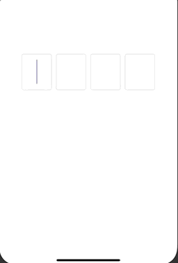

# CodeInserterView

[](https://cocoapods.org/pods/CodeInserterView)
[](https://cocoapods.org/pods/CodeInserterView)
[](https://cocoapods.org/pods/CodeInserterView)

## Description

CodeInserterView is a dynamic code inserter, which can be from 1 to 8 digit fields. There are an automatic jump to the next field and an automatic return to the previous field. It can be used for input types of verification code.

## Functionality

In this gif example, there is the CodeInserterView with FOUR digit fields. In your code you can set between ONE and EIGHT.



## Usage

It is used through view coding. 

Do not forget to modify the `translatesAutoresizingMaskIntoConstraints` variable to `false`.

Set the respectives constraints for the CodeInserterView, add in your view and voilá!

## Controlling CodeInserterView

* `var shouldReturnDigit` default is YES, which returns to the previous textfield when the backspace is tapped.
* `func allDigitsTextfieldsFilled()` return YES if all the digit fields are filled

## Installation

CodeInserterView is available through [CocoaPods](https://cocoapods.org/pods/CodeInserterView). To install
it, simply add the following line to your Podfile:

```ruby
pod 'CodeInserterView'
```
When you are done make sure to run "pod install". 

That is it! Simply import the module and use.

## Author

Arthur Giachini, arthur.giachini@acad.pucrs.br

## License

CodeInserterView is available under the MIT license. See the LICENSE file for more info.
